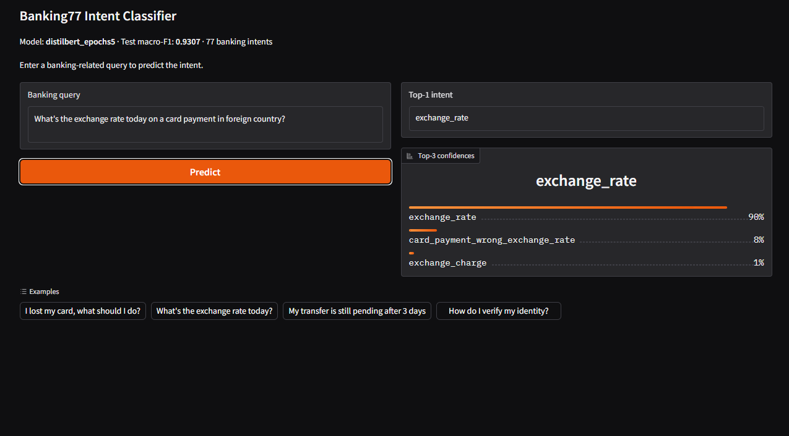
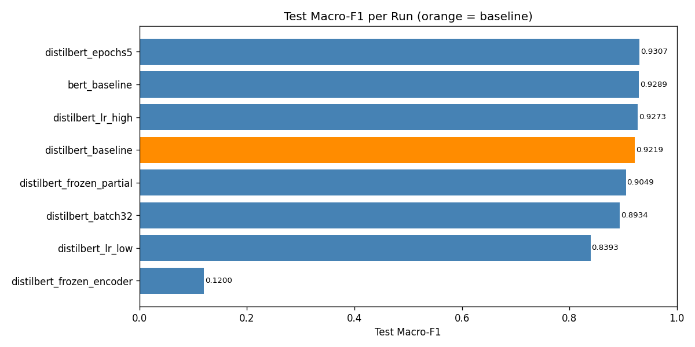

# Banking77 Intent Classification

Fine-tuning DistilBERT and BERT for 77-class banking query classification.

  

> Fine-tuned DistilBERT on the Banking77 dataset to classify customer queries into 77 fine-grained banking intents, reaching **93.07% test macro-F1** in ~3 minutes on an RTX 4060 Laptop.

## Motivation

Course assignment for **TUKE FEI, BSc Intelligent Systems Y2** (Machine Learning, *Zadanie 20 — Ladenie Transformer*).
The goal was to take a pretrained Transformer and adapt it to a real downstream task end-to-end: data pipeline, training loop, hyperparameter sweep, evaluation, and a working demo.
Banking77 was chosen because 77 fine-grained classes make it non-trivial (many semantically close intents like `card_payment_fee_charged` vs. `cash_withdrawal_charge`), and the dataset is small enough to run a full 8-run sweep on a consumer laptop GPU.

This repo is also a portfolio artifact — a reproducible, documented, single-GPU fine-tuning pipeline.

## Demo



Single-text-input web app: enter a banking query, get the predicted intent + top-3 confidences. Loads the best run (`distilbert_epochs5`) on startup. ~4 ms warm inference on GPU.

## Dataset

[**Banking77**](https://huggingface.co/datasets/PolyAI/banking77) (PolyAI) — 13,083 customer service queries labeled with one of 77 fine-grained banking intents.

| Split | Size | Source |
|-------|------|--------|
| Train | 9,002 | Carved from official train (90/10 stratified split, seed=42) |
| Val   | 1,001 | Carved from official train |
| Test  | 3,080 | Official test set, untouched until final eval |

Class imbalance: 5.25× (min 32, max 168 samples per class). Token length: mean 16, p99 53, max 98 → `max_length=128` truncates 0% of inputs.

## Key Results

| Run | Model | LR | Epochs | Freeze | Test Macro-F1 | Wall-clock |
|-----|-------|----|--------|--------|---------------|------------|
| **distilbert_epochs5** | DistilBERT-base | 5e-5 | 5 | none | **0.9307** | 188s |
| bert_baseline | BERT-base | 5e-5 | 3 | none | 0.9289 | 197s |
| distilbert_lr_high | DistilBERT-base | 1e-4 | 3 | none | 0.9273 | 113s |
| distilbert_baseline | DistilBERT-base | 5e-5 | 3 | none | 0.9219 | 114s |
| distilbert_frozen_partial | DistilBERT-base | 5e-5 | 3 | bottom 3 | 0.9049 | 73s |
| distilbert_batch32 | DistilBERT-base | 5e-5 | 3 | none | 0.8934 | 199s |
| distilbert_lr_low | DistilBERT-base | 2e-5 | 3 | none | 0.8393 | 113s |
| distilbert_frozen_encoder | DistilBERT-base | 5e-5 | 3 | all encoder | 0.1200 | 73s |

**Headline:** `distilbert_epochs5` — test macro-F1 **0.9307**, accuracy **0.9305**.
DistilBERT with 5 epochs beats BERT-base (3 epochs) at roughly half the wall-clock cost.



📄 **Full analysis:** [REPORT.md](REPORT.md) — 9 sections + 4 appendices, including defense Q&A.

## Repository Structure

```
transformer_project/
├── src/
│   ├── config.py          # ExperimentConfig dataclass + 8 factory functions
│   ├── data.py            # Banking77 loader + tokenizer
│   ├── train.py           # HF Trainer wrapper (freeze strategies, CSV logging)
│   ├── evaluate.py        # Test-set evaluation + plots
│   ├── analysis.py        # Cross-run aggregation helpers
│   └── app.py             # Gradio demo app
├── scripts/
│   ├── run_all_experiments.py  # Sequential sweep runner
│   └── ...
├── notebooks/
│   └── analysis.ipynb     # Cross-run comparison notebook
├── experiments/
│   ├── distilbert_baseline/    # Run artifacts (config, metrics, plots)
│   ├── distilbert_epochs5/     # ... (best model)
│   ├── ...
│   └── _summary/               # Aggregated cross-run plots + summary table
├── docs/
│   └── screenshots/       # Demo screenshots
├── archive/
│   ├── decisions.md       # Design decisions log
│   └── debug_log.md       # Issue log
├── context.md             # Project plan (static)
├── status.txt             # Current phase + per-phase summary
├── run_app.bat            # Windows one-click launcher
├── requirements.txt
└── pyproject.toml
```

## Quick Start

```bash
git clone https://github.com/matus012/transformer_project.git
cd transformer_project
python -m venv .venv
.venv\Scripts\activate          # Windows
# source .venv/bin/activate     # Linux/macOS
pip install -r requirements.txt
pip install -e .
```

> **Note:** `experiments/*/best_model/` is gitignored — model weights are not included in the repo.
> You must train before running the demo. Two options:
>
> **Option A — Single best run** (~188s on RTX 4060 + fp16):
> ```bash
> python scripts/run_all_experiments.py --only distilbert_epochs5
> ```
>
> **Option B — Full 8-run sweep** (~17 min on RTX 4060 + fp16):
> ```bash
> python scripts/run_all_experiments.py
> ```

## Reproduce Experiments

**Single baseline run:**
```bash
python -m src.train --config baseline
```

**Full 8-run sweep:**
```bash
python scripts/run_all_experiments.py
```

**Single named run:**
```bash
python scripts/run_all_experiments.py --only distilbert_epochs5
```

**Evaluate a saved run on test set:**
```bash
python -m src.evaluate --run_dir experiments/distilbert_epochs5 --split test
```

**Cross-run analysis notebook:**
```bash
jupyter notebook notebooks/analysis.ipynb
```

All runs use seed=42, fp16 mixed precision, AdamW, weight decay 0.01, warmup 500 steps, max_length=128. Best checkpoint selected by validation macro-F1.

## Run the Demo

After training `distilbert_epochs5` (see Quick Start above):

**Windows (one-click):**
```
run_app.bat
```

**Manual:**
```bash
python src/app.py
```

Open http://127.0.0.1:7860 in a browser. Enter any banking query to predict the intent with top-3 confidence scores.

## Hardware & Training Cost

- **GPU:** RTX 4060 Laptop, 8 GB VRAM
- **CPU/RAM:** i7-13650HX, 16 GB
- **Mixed precision:** fp16 (all runs)
- **Total GPU time across all 8 runs:** ~17 minutes
- **Best single run:** 188s (`distilbert_epochs5`)

## License

[MIT](LICENSE) © Matus Filo