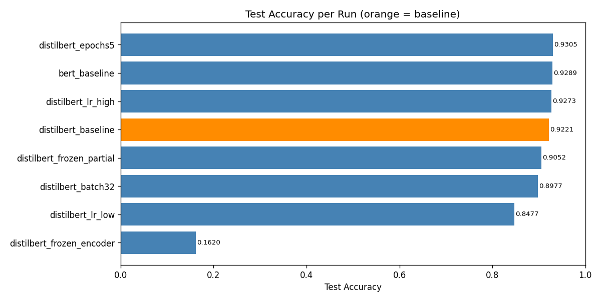
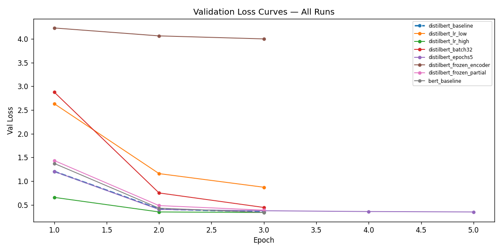
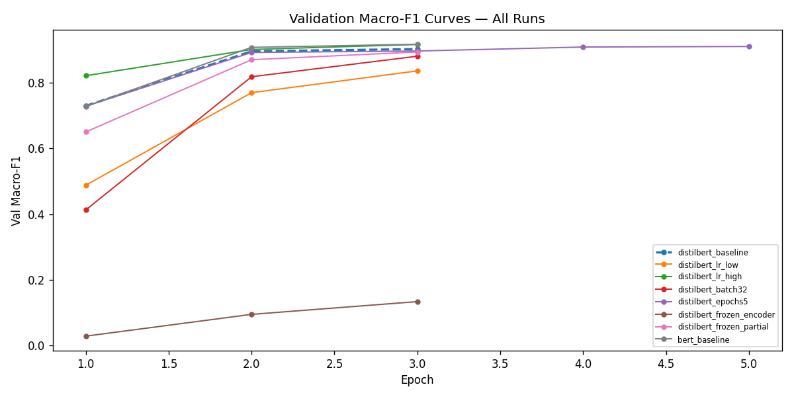
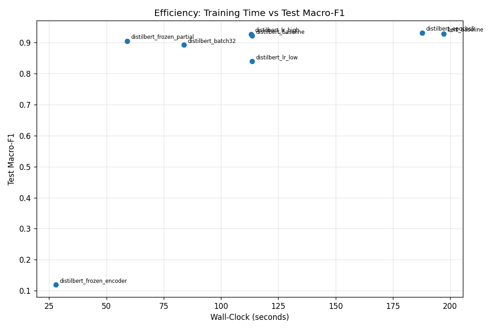
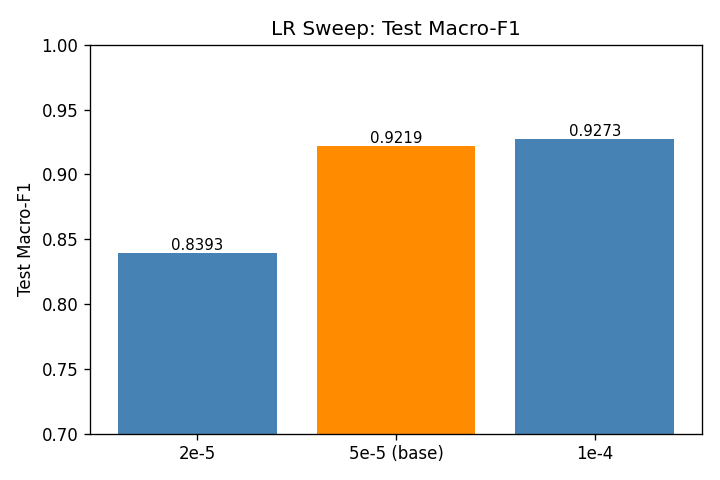
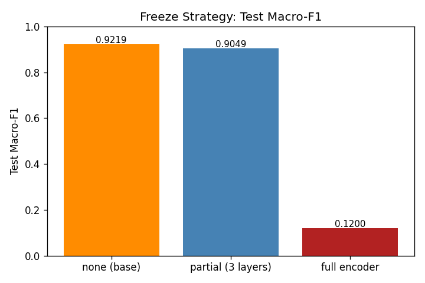
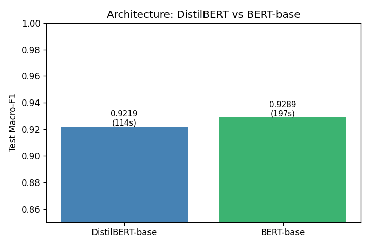
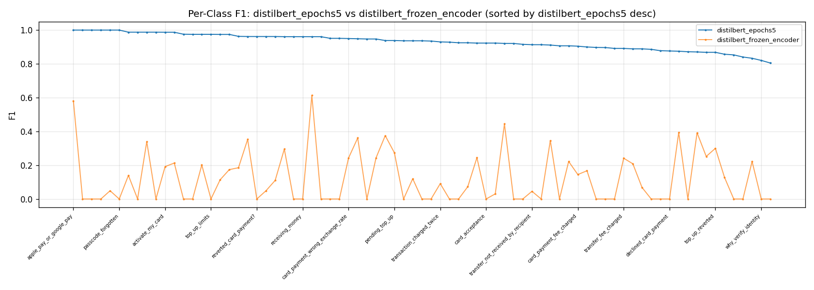

# Banking77 Intent Classification: Fine-Tuning Transformer Models

**Course:** Machine Learning, TUKE FEI, BSc Intelligent Systems, Year 2
**Assignment:** Zadanie 20 — Ladenie neurónovej siete typu Transformer
**Author:** matus012
**Date:** 2026-05-01

---

## Abstract

This report describes the fine-tuning of pre-trained transformer models for 77-class intent classification on the Banking77 dataset [Casanueva et al., 2020]. Eight experimental runs were conducted: one DistilBERT baseline, five DistilBERT ablations varying learning rate, batch size, training epochs, and encoder freeze depth, and one BERT-base comparison. The best model, `distilbert_epochs5` (DistilBERT fine-tuned for 5 epochs at LR=5e-5), achieves test macro-F1 of 0.9307 and accuracy of 0.9305 on the 3,080-example test set in 188 seconds of GPU training on an RTX 4060 Laptop. The key finding is that increasing training epochs on the smaller DistilBERT model yields better performance than switching to the larger BERT-base at the same epoch budget, at roughly half the wall-clock cost. Head-only fine-tuning (frozen encoder) collapses to macro-F1 of 0.1200, confirming that encoder fine-tuning is essential for this task.

---

## 1. Introduction

### 1.1 Problem Statement

Banking virtual assistants must route customer queries to the correct handling workflow. This requires classifying free-text input into one of many fine-grained intent categories. With 77 possible intents, many semantically similar (e.g., `pending_transfer` vs. `failed_transfer`), the task demands high-quality sentence representations.

### 1.2 Why Banking77

Banking77 [Casanueva et al., 2020] is a benchmark dataset of 13,083 online banking customer service queries annotated with 77 fine-grained intent labels. Each query is a short natural-language sentence (mean 16 tokens). The dataset is widely used for intent detection benchmarking, has a clean HuggingFace distribution, and presents non-trivial class separability due to semantically overlapping intents (e.g., `card_not_working` vs. `contactless_not_working`).

### 1.3 Contributions

1. An 8-run systematic ablation of DistilBERT fine-tuning hyperparameters (LR, batch size, epochs, freeze depth) plus a BERT-base comparison.
2. Quantified cost-benefit analysis: DistilBERT at 5 epochs (0.9307, 188s) dominates BERT-base at 3 epochs (0.9289, 197s).
3. Demonstration that partial encoder freezing (3 of 6 DistilBERT layers) is viable: loses only 0.0258 macro-F1 vs. the full fine-tuning baseline at 48% wall-clock savings.
4. A reproducible experimental framework: pinned dependencies, per-run `config.json` + `git_commit.txt`, seed-controlled training, and a Gradio demo app.

---

## 2. Background

### 2.1 Transformer Architecture

The Transformer [Vaswani et al., 2017] is a sequence model built entirely on attention mechanisms, without recurrence or convolution. The encoder stack processes the full input sequence in parallel. Each encoder layer consists of:

1. **Multi-head self-attention:** For each head $h$, the input sequence $X \in \mathbb{R}^{n \times d}$ is projected to queries $Q = XW_Q$, keys $K = XW_K$, values $V = XW_V$, and attention output is computed as:

$$\text{Attention}(Q, K, V) = \text{softmax}\!\left(\frac{QK^\top}{\sqrt{d_k}}\right)V$$

Multiple heads are concatenated and projected. This allows the model to attend to different positions simultaneously.

2. **Position-wise feed-forward network:** A two-layer MLP applied identically to each position.
3. **Residual connections + Layer Normalization:** Applied around both sub-layers for stable training.

For classification, a special `[CLS]` token is prepended to the input sequence. Its final hidden state serves as the sequence-level representation fed to the classification head.

### 2.2 BERT and DistilBERT

**BERT** [Devlin et al., 2019] is a 12-layer, 110M-parameter transformer pre-trained on English Wikipedia and BookCorpus using two objectives: Masked Language Modeling (MLM, predict randomly masked tokens) and Next Sentence Prediction (NSP). Pre-training produces contextualized token embeddings that transfer well to downstream tasks via fine-tuning.

**WordPiece tokenization** splits words into known subword pieces from a fixed vocabulary (30,522 tokens for `bert-base-uncased`). Unknown words are decomposed: e.g., "fintech" -> ["fin", "##tech"]. This eliminates OOV tokens and handles morphological variants naturally.

**DistilBERT** [Sanh et al., 2019] is a distilled version of BERT with 6 layers and 66M parameters (vs. BERT's 12 layers, 110M). Knowledge distillation during pre-training transfers BERT's representations to the smaller model. DistilBERT retains approximately 97% of BERT's performance on GLUE benchmarks while being 40% smaller and 60% faster at inference.

### 2.3 Fine-Tuning vs. From-Scratch Training

Training a transformer from scratch on Banking77 (9,002 training examples) would be infeasible: the model would need to learn both language representations and task-specific patterns simultaneously from a small dataset. Fine-tuning instead initialises from pre-trained weights and adapts them with a small learning rate on the target task. Only the task-specific classification head (linear projection from hidden dimension to number of classes) is randomly initialised; all other parameters begin from the pre-trained checkpoint. This approach converges in 3-5 epochs rather than hundreds.

### 2.4 Transfer Learning Depth

The depth at which pre-trained representations are modified during fine-tuning affects both performance and training cost:

- **Full fine-tuning (freeze_strategy=none):** All layers updated. Best performance, highest cost.
- **Partial freeze (freeze_strategy=partial):** Lower transformer layers and embeddings frozen; upper layers and head updated. Preserves low-level linguistic features, adapts task-specific representations.
- **Head-only (freeze_strategy=encoder):** Only the classification head trained; all encoder parameters frozen. Fastest training, uses fixed pre-trained representations as features.

For Banking77, lower layers are expected to capture general linguistic syntax (shared across tasks), while upper layers encode semantic meaning (task-sensitive). Freezing all encoder layers forces the model to linearly separate 77 intent classes from fixed 768-dimensional CLS vectors — a fundamentally harder problem.

---

## 3. Dataset

### 3.1 Banking77

Banking77 [Casanueva et al., 2020] contains 13,083 English online banking customer service queries across 77 intent categories. The standard split provides 10,003 training examples and 3,080 test examples (40 examples per class in the test set).

### 3.2 Class Imbalance

The training set has a class imbalance ratio of **5.25x** (minimum 32 samples, maximum 168 samples per class). This motivates using macro-F1 as the primary evaluation metric rather than accuracy, since macro-F1 weights each class equally regardless of support.

### 3.3 Token Length Statistics

Banking77 queries are short: mean token length 16, 99th-percentile 53, maximum 98 tokens (using WordPiece tokenization). Setting `max_length=128` results in **0% truncation** across the full dataset. Padding to `max_length` ensures uniform tensor shapes, which is required for efficient fp16 training without dynamic padding complexity.

### 3.4 Train/Validation/Test Split

A stratified 90/10 split of the 10,003 training examples was used to create a validation set (9,002 train + 1,001 validation), preserving class proportions. `seed=42` ensures reproducibility. The 3,080-example test set was held out until final evaluation per run; it was never used for hyperparameter selection.

---

## 4. Methodology

### 4.1 Models

| Model | Layers | Hidden dim | Params | Notes |
|-------|--------|------------|--------|-------|
| `distilbert-base-uncased` | 6 | 768 | 66M | Primary model |
| `bert-base-uncased` | 12 | 768 | 110M | Comparison model |

Both models use `AutoModelForSequenceClassification` from HuggingFace Transformers with `num_labels=77`. A randomly initialised linear head (768 -> 77) replaces the default classification head.

### 4.2 Tokenization

WordPiece tokenizer with `max_length=128`, `padding='max_length'`, `truncation=True`. Padding to fixed length (`'max_length'`) was chosen over dynamic padding because it produces uniform tensor shapes, simplifying fp16 batch processing and avoiding variable-length scatter in GPU memory.

### 4.3 Training Setup

All runs use the HuggingFace `Trainer` API with the following fixed hyperparameters (varied only where specified per run):

| Hyperparameter | Value |
|---------------|-------|
| Optimizer | AdamW (Trainer default) |
| Weight decay | 0.01 |
| Warmup steps | 500 |
| FP16 | True |
| Seed | 42 |
| Eval strategy | per epoch |
| Save strategy | per epoch |
| save_total_limit | 1 |
| Best checkpoint criterion | val macro-F1 |
| load_best_model_at_end | True |

### 4.4 Evaluation Metrics

- **Accuracy:** fraction of correctly classified test examples.
- **Macro-F1 (primary):** unweighted mean of per-class F1 scores. Appropriate for Banking77's 5.25x class imbalance — gives equal weight to all 77 intents regardless of support.
- **Weighted-F1:** support-weighted mean of per-class F1. Included for completeness; equals macro-F1 here because test set has equal support (40 examples per class).
- **Per-class F1:** individual F1 per intent class. Used for error analysis.
- **Confusion matrix:** 77x77 heatmap, annotated for cells with count >= 5.

The F1 score for class $c$ is:

$$F1_c = \frac{2 \cdot \text{precision}_c \cdot \text{recall}_c}{\text{precision}_c + \text{recall}_c}$$

Macro-F1 = $\frac{1}{77} \sum_{c=1}^{77} F1_c$.

### 4.5 Hyperparameter Selection

Best model checkpoint selected by validation macro-F1. No early stopping — training runs for the full specified number of epochs, then `load_best_model_at_end=True` restores the best checkpoint for test evaluation.

---

## 5. Experimental Setup

### 5.1 Hardware

| Component | Specification |
|-----------|---------------|
| CPU | Intel Core i7-13650HX |
| RAM | 16 GB |
| GPU | RTX 4060 Laptop, 8 GB VRAM |
| CUDA | 12.6 (driver 581.86) |
| OS | Windows 11 Pro |

All training and inference runs on GPU with fp16 precision. CPU fallback would increase wall-clock by approximately 50x.

### 5.2 Software

| Package | Version |
|---------|---------|
| Python | 3.11.9 |
| PyTorch | 2.5.1+cu121 |
| transformers | 4.46.3 |
| datasets | 3.1.0 |
| scikit-learn | 1.5.2 |
| gradio | 5.7.1 |

### 5.3 Experiment Matrix

| Run | Model | LR | Batch | Epochs | Freeze | Purpose |
|-----|-------|----|-------|--------|--------|---------|
| distilbert_baseline | DistilBERT | 5e-5 | 16 | 3 | none | Baseline |
| distilbert_lr_low | DistilBERT | 2e-5 | 16 | 3 | none | LR lower |
| distilbert_lr_high | DistilBERT | 1e-4 | 16 | 3 | none | LR higher |
| distilbert_batch32 | DistilBERT | 5e-5 | 32 | 3 | none | Batch larger |
| distilbert_epochs5 | DistilBERT | 5e-5 | 16 | 5 | none | More epochs |
| distilbert_frozen_encoder | DistilBERT | 5e-5 | 16 | 3 | encoder | Head-only |
| distilbert_frozen_partial | DistilBERT | 5e-5 | 16 | 3 | partial (layers 0-2 + emb) | Partial freeze |
| bert_baseline | BERT-base | 5e-5 | 16 | 3 | none | Architecture comparison |

### 5.4 Reproducibility

- `seed=42` set for Python `random`, `numpy`, `torch`, and `torch.cuda` via `set_seed()` before each run.
- `torch.use_deterministic_algorithms` not set — GPU non-determinism accepted as a throughput trade-off; documented in `archive/decisions.md`.
- `requirements.txt` pins all package versions.
- Each run saves `config.json` (full `ExperimentConfig`) and `git_commit.txt` (HEAD hash at training time).
- Wall-clock training time logged per run in `training_log.txt`.

---

## 6. Results

### 6.1 Final Metrics Table

| run_name | model | lr | batch | epochs | freeze | val_f1 | test_acc | test_macro_f1 | wall_clock_s |
|----------|-------|----|-------|--------|--------|--------|----------|---------------|-------------|
| distilbert_epochs5 | distilbert-base-uncased | 5e-5 | 16 | 5 | none | 0.9114 | 0.9305 | **0.9307** | 187.9 |
| bert_baseline | bert-base-uncased | 5e-5 | 16 | 3 | none | 0.9182 | 0.9289 | 0.9289 | 197.2 |
| distilbert_lr_high | distilbert-base-uncased | 1e-4 | 16 | 3 | none | 0.9175 | 0.9273 | 0.9273 | 113.1 |
| distilbert_baseline | distilbert-base-uncased | 5e-5 | 16 | 3 | none | 0.9035 | 0.9221 | 0.9219 | 113.5 |
| distilbert_frozen_partial | distilbert-base-uncased | 5e-5 | 16 | 3 | partial | 0.8945 | 0.9052 | 0.9049 | 59.1 |
| distilbert_batch32 | distilbert-base-uncased | 5e-5 | 32 | 3 | none | 0.8817 | 0.8977 | 0.8934 | 83.9 |
| distilbert_lr_low | distilbert-base-uncased | 2e-5 | 16 | 3 | none | 0.8369 | 0.8477 | 0.8393 | 113.6 |
| distilbert_frozen_encoder | distilbert-base-uncased | 5e-5 | 16 | 3 | encoder | 0.1328 | 0.1620 | 0.1200 | 27.9 |

### 6.2 Cross-Run Accuracy Comparison



*Figure 1: Test accuracy for all 8 runs, sorted ascending. Orange bar = distilbert_baseline (reference). The frozen encoder run (0.1620) is a clear outlier; among fully fine-tuned runs, accuracy ranges from 0.8477 (lr_low) to 0.9305 (epochs5). The ranking is consistent across accuracy and macro-F1.*

### 6.3 Cross-Run Macro-F1 Comparison


*Figure 2: Test macro-F1 for all 8 runs. The spread among the top 4 runs (0.9219 to 0.9307) is relatively small (0.0088), suggesting that the pre-trained representations are robust across moderate hyperparameter variation. The frozen encoder result (0.1200) confirms that encoder fine-tuning is non-negotiable for this task.*

### 6.4 Training Curves



*Figure 3: Validation loss curves. All fully fine-tuned runs converge within 3 epochs. The frozen_encoder run has a high, flat loss trajectory (encoder never adapts). distilbert_epochs5 shows continued improvement through epoch 5, justifying the extended training.*



*Figure 4: Validation macro-F1 curves. The distilbert_epochs5 run (5 epochs) shows continued improvement from epoch 3 (0.9035 baseline) to epoch 5 (0.9114), confirming that the model has not saturated at 3 epochs. The lr_high run achieves the highest single-epoch val-F1 (0.9175 at epoch 3) but was not run for additional epochs.*

### 6.5 Time vs. Accuracy Trade-off



*Figure 5: Efficiency scatter plot. The Pareto frontier (best F1 per wall-clock budget) runs through: distilbert_frozen_partial (59s, 0.9049) -> distilbert_baseline (113s, 0.9219) -> distilbert_epochs5 (188s, 0.9307). BERT-base (197s, 0.9289) is dominated by distilbert_epochs5: more wall-clock for lower F1. The frozen_encoder run (28s, 0.1200) is strictly dominated.*

### 6.6 Hyperparameter Ablations

#### 6.6.1 Learning Rate Sweep



*Figure 6: Effect of learning rate at fixed 3 epochs. LR=2e-5 undertrains at 3 epochs (0.8393), likely because the effective update magnitude is too small to converge within 1,689 training steps. LR=1e-4 achieves the highest 3-epoch result (0.9273), suggesting the default 5e-5 is slightly conservative. However, higher LR carries a divergence risk at longer training runs.*

#### 6.6.2 Freeze Strategy



*Figure 7: Effect of encoder freeze strategy. Full fine-tuning (none): 0.9219. Partial freeze (bottom 3 of 6 DistilBERT layers + embeddings): 0.9049 (-0.0170). Full encoder freeze (head-only): 0.1200 (-0.8019). Partial freezing is a viable compromise: -1.8% F1 at -48% wall-clock (59s vs. 113s). Head-only training fails because fixed CLS representations are not discriminative enough for 77 semantically overlapping banking intents.*

#### 6.6.3 Architecture Comparison



*Figure 8: DistilBERT-base (0.9219, 113s) vs. BERT-base (0.9289, 197s) at matched 3-epoch budget. BERT-base gains +0.0070 macro-F1 at 1.74x the wall-clock cost. However, extending DistilBERT to 5 epochs (0.9307, 188s) reverses this: DistilBERT epochs5 outperforms BERT-base baseline at essentially the same wall-clock. Conclusion: given a fixed time budget, longer DistilBERT training dominates BERT-base for this task.*

### 6.7 Per-Class Analysis



*Figure 9: Per-class F1 for distilbert_epochs5 (best run) vs. distilbert_frozen_encoder, sorted by distilbert_epochs5 F1 descending. The frozen encoder achieves near-random performance on most classes, while the fine-tuned model achieves F1 >= 0.81 on all 77 classes.*

From the baseline classification report (representative of the fully fine-tuned models):
- **5 classes with F1 = 1.0:** `apple_pay_or_google_pay`, `atm_support`, `cancel_transfer`, `passcode_forgotten`, `verify_source_of_funds`
- **5 lowest F1 classes:** `pending_transfer` (0.8101), `declined_transfer` (0.8235), `why_verify_identity` (0.8378), `fiat_currency_support` (0.8462), `get_disposable_virtual_card` (0.8462)
- All 77 classes achieve F1 >= 0.81 in the baseline run (worst: `pending_transfer` at 0.8101).

The hardest classes (`pending_transfer`, `declined_transfer`) are semantically similar and share surface vocabulary — distinguishing them requires understanding subtle intent nuances. No class collapses to F1 = 0.

### 6.8 Confusion Matrix


*Figure 10: 77x77 confusion matrix for distilbert_baseline on the test set. Cells annotated only where count >= 5 to reduce clutter. The diagonal dominates; off-diagonal mass is concentrated around semantically similar intent pairs (transfer-related and card-related clusters).*

---

## 7. Discussion

### 7.1 What Worked

**Full fine-tuning consistently succeeds.** All 6 fully fine-tuned runs achieve test macro-F1 >= 0.839, confirming that DistilBERT's pre-trained representations are strongly transferable to the banking intent domain.

**Epochs beat architecture.** Extending DistilBERT to 5 epochs (0.9307) outperforms switching to the larger BERT-base at 3 epochs (0.9289), at essentially the same wall-clock cost (188s vs. 197s). For a fixed compute budget, training longer on the smaller model is the more efficient choice.

**Partial freeze is viable.** Freezing the bottom 3 of 6 DistilBERT transformer layers plus embeddings yields 0.9049 macro-F1 — only 0.0170 below the full fine-tuning baseline — at 59s vs. 113s wall-clock (-48%). This is useful when GPU budget is constrained, e.g., for rapid iteration or deployment on smaller hardware.

**No overfitting in 3-5 epochs.** All runs show val macro-F1 <= test macro-F1, with the baseline achieving val 0.9035 -> test 0.9219. The test set marginally outperforms validation in all cases, suggesting the 9,002-sample fine-tuning set is not causing overfit at these epoch counts.

### 7.2 What Didn't Work

**distilbert_lr_low (LR=2e-5):** The lowest learning rate (0.8393 test F1) underperforms the baseline by 0.0826. At only 1,689 training steps per epoch x 3 epochs = 5,067 steps with warmup_steps=500, LR=2e-5 does not converge sufficiently. More epochs would likely recover performance, but at the 3-epoch budget it is the second-worst fully fine-tuned run.

**distilbert_batch32:** Doubling batch size to 32 slightly degrades performance (0.8934 vs. 0.9219 baseline, -0.0285). The likely cause: with batch=32, each epoch has 844 gradient steps vs. 1,689 at batch=16, meaning the warmup_steps=500 consumes a larger fraction of total training, leaving fewer steps at peak LR. A corresponding LR scaling or reduced warmup would likely recover performance.

**distilbert_frozen_encoder:** Head-only training collapses to macro-F1 = 0.1200. Fixed 768-dimensional CLS vectors from DistilBERT are not linearly separable across 77 semantically overlapping banking intents. The pre-trained encoder was not trained on domain-specific vocabulary, and the frozen representation does not distinguish `pending_transfer` from `failed_transfer` at the required granularity. This result confirms that encoder adaptation is essential.

### 7.3 DistilBERT vs. BERT Cost-Benefit

At a 3-epoch matched budget: BERT-base achieves +0.0070 macro-F1 over DistilBERT at 1.74x wall-clock (197s vs. 113s). The gain is marginal. Given that DistilBERT at 5 epochs (0.9307, 188s) dominates BERT-base at 3 epochs (0.9289, 197s), the practical recommendation for this task is: use DistilBERT and train longer. BERT-base's advantage diminishes once the epoch budget is unconstrained.

### 7.4 Generalization

All runs show near-zero or positive generalization gap (val F1 <= test F1). This is partially explained by the test set having equal class support (40 examples/class), making it a slightly more balanced evaluation than the validation set. No signs of overfitting at 3-5 epochs; the training set (9,002 examples) is sufficient to prevent overfit at this model scale.

### 7.5 Limitations

- **Single seed.** All runs use seed=42. Variance across seeds is not estimated; reported metrics may be seed-dependent to a small degree.
- **No LR scaling for batch size.** Linear LR scaling (LR x batch_multiplier) was not applied when changing batch size. This may have contributed to the batch=32 regression.
- **No early stopping.** Fixed epoch budget with best-checkpoint restoration. Early stopping could improve efficiency for runs that plateau early.
- **No parameter-efficient methods.** LoRA, adapters, and prefix tuning were out of scope. These could match fine-tuning performance with far fewer trainable parameters.
- **No extended BERT training.** BERT-base at 5 epochs was not tested. It may outperform DistilBERT at 5 epochs; this remains an open experiment.

---

## 8. Conclusion

The best model, `distilbert_epochs5`, achieves test macro-F1 of **0.9307** and accuracy of **0.9305** on Banking77, trained in 188 seconds on an RTX 4060 Laptop. The central finding of this study is that **training duration matters more than model size** for this task: extending DistilBERT (66M parameters) to 5 epochs produces better results than using the larger BERT-base (110M parameters) at 3 epochs, at essentially the same wall-clock cost.

Partial encoder freezing is a viable efficiency trade-off (-1.7% F1, -48% training time). Head-only training is not viable for this task, where 77 semantically overlapping intents require encoder-level adaptation.

Future work could explore: LoRA or adapter-based fine-tuning for parameter efficiency, multi-seed variance estimation, per-class loss weighting to improve tail-class performance, longer BERT-base training, and extended DistilBERT training beyond 5 epochs to identify the saturation point.

---

## 9. References

[Casanueva et al., 2020] Casanueva, I., Temcinas, T., Gerz, D., Henderson, M., and Vulic, I. (2020). *Efficient Intent Detection with Dual Sentence Encoders.* In Proceedings of the 2nd Workshop on Natural Language Processing for Conversational AI, ACL 2020. Dataset available at https://huggingface.co/datasets/PolyAI/banking77.

[Devlin et al., 2019] Devlin, J., Chang, M.-W., Lee, K., and Toutanova, K. (2019). *BERT: Pre-training of Deep Bidirectional Transformers for Language Understanding.* In Proceedings of NAACL-HLT 2019, pages 4171-4186.

[Sanh et al., 2019] Sanh, V., Debut, L., Chaumond, J., and Wolf, T. (2019). *DistilBERT, a distilled version of BERT: smaller, faster, cheaper and lighter.* arXiv preprint arXiv:1910.01108.

[Vaswani et al., 2017] Vaswani, A., Shazeer, N., Parmar, N., Uszkoreit, J., Jones, L., Gomez, A. N., Kaiser, L., and Polosukhin, I. (2017). *Attention Is All You Need.* In Advances in Neural Information Processing Systems 30 (NeurIPS 2017).

[Wolf et al., 2020] Wolf, T., Debut, L., Sanh, V., Chaumond, J., Delangue, C., Moi, A., Cistac, P., Rault, T., Louf, R., Funtowicz, M., et al. (2020). *Transformers: State-of-the-Art Natural Language Processing.* In Proceedings of EMNLP 2020 (System Demonstrations), pages 38-45.

---

## Appendix A — Full Classification Report (distilbert_baseline)

```text
                                                  precision    recall  f1-score   support

                                activate_my_card     1.0000    0.9750    0.9873        40
                                       age_limit     0.9756    1.0000    0.9877        40
                         apple_pay_or_google_pay     1.0000    1.0000    1.0000        40
                                     atm_support     1.0000    1.0000    1.0000        40
                                automatic_top_up     1.0000    0.9000    0.9474        40
         balance_not_updated_after_bank_transfer     0.8293    0.8500    0.8395        40
balance_not_updated_after_cheque_or_cash_deposit     1.0000    0.9500    0.9744        40
                         beneficiary_not_allowed     0.9048    0.9500    0.9268        40
                                 cancel_transfer     1.0000    1.0000    1.0000        40
                            card_about_to_expire     0.9756    1.0000    0.9877        40
                                 card_acceptance     0.8947    0.8500    0.8718        40
                                    card_arrival     0.9211    0.8750    0.8974        40
                          card_delivery_estimate     0.8810    0.9250    0.9024        40
                                    card_linking     0.9512    0.9750    0.9630        40
                                card_not_working     0.8667    0.9750    0.9176        40
                        card_payment_fee_charged     0.8636    0.9500    0.9048        40
                     card_payment_not_recognised     0.8974    0.8750    0.8861        40
                card_payment_wrong_exchange_rate     0.9500    0.9500    0.9500        40
                                  card_swallowed     1.0000    0.8750    0.9333        40
                          cash_withdrawal_charge     0.9744    0.9500    0.9620        40
                  cash_withdrawal_not_recognised     0.8444    0.9500    0.8941        40
                                      change_pin     0.9512    0.9750    0.9630        40
                                compromised_card     0.9444    0.8500    0.8947        40
                         contactless_not_working     1.0000    0.8750    0.9333        40
                                 country_support     0.9048    0.9500    0.9268        40
                           declined_card_payment     0.7872    0.9250    0.8506        40
                        declined_cash_withdrawal     0.8333    1.0000    0.9091        40
                               declined_transfer     1.0000    0.7000    0.8235        40
             direct_debit_payment_not_recognised     0.9189    0.8500    0.8831        40
                          disposable_card_limits     0.9459    0.8750    0.9091        40
                           edit_personal_details     0.9756    1.0000    0.9877        40
                                 exchange_charge     0.9737    0.9250    0.9487        40
                                   exchange_rate     0.8696    1.0000    0.9302        40
                                exchange_via_app     0.8372    0.9000    0.8675        40
                       extra_charge_on_statement     0.9286    0.9750    0.9512        40
                                 failed_transfer     0.8780    0.9000    0.8889        40
                           fiat_currency_support     0.8684    0.8250    0.8462        40
                     get_disposable_virtual_card     0.8684    0.8250    0.8462        40
                               get_physical_card     0.9524    1.0000    0.9756        40
                              getting_spare_card     0.9070    0.9750    0.9398        40
                            getting_virtual_card     0.7647    0.9750    0.8571        40
                             lost_or_stolen_card     0.8043    0.9250    0.8605        40
                            lost_or_stolen_phone     0.9512    0.9750    0.9630        40
                             order_physical_card     0.9024    0.9250    0.9136        40
                              passcode_forgotten     1.0000    1.0000    1.0000        40
                            pending_card_payment     0.9250    0.9250    0.9250        40
                         pending_cash_withdrawal     0.9512    0.9750    0.9630        40
                                  pending_top_up     0.8810    0.9250    0.9024        40
                                pending_transfer     0.8205    0.8000    0.8101        40
                                     pin_blocked     0.9730    0.9000    0.9351        40
                                 receiving_money     1.0000    0.9000    0.9474        40
                           Refund_not_showing_up     1.0000    0.9500    0.9744        40
                                  request_refund     0.9750    0.9750    0.9750        40
                          reverted_card_payment?     0.8636    0.9500    0.9048        40
                  supported_cards_and_currencies     0.9024    0.9250    0.9136        40
                               terminate_account     0.9756    1.0000    0.9877        40
                  top_up_by_bank_transfer_charge     0.9167    0.8250    0.8684        40
                           top_up_by_card_charge     0.9286    0.9750    0.9512        40
                        top_up_by_cash_or_cheque     0.9487    0.9250    0.9367        40
                                   top_up_failed     0.8810    0.9250    0.9024        40
                                   top_up_limits     0.9500    0.9500    0.9500        40
                                 top_up_reverted     0.9697    0.8000    0.8767        40
                              topping_up_by_card     0.8250    0.8250    0.8250        40
                       transaction_charged_twice     0.9091    1.0000    0.9524        40
                            transfer_fee_charged     0.9024    0.9250    0.9136        40
                           transfer_into_account     0.8947    0.8500    0.8718        40
              transfer_not_received_by_recipient     0.9231    0.9000    0.9114        40
                                 transfer_timing     0.8372    0.9000    0.8675        40
                       unable_to_verify_identity     0.9487    0.9250    0.9367        40
                              verify_my_identity     0.8043    0.9250    0.8605        40
                          verify_source_of_funds     1.0000    1.0000    1.0000        40
                                   verify_top_up     1.0000    1.0000    1.0000        40
                        virtual_card_not_working     1.0000    0.7500    0.8571        40
                              visa_or_mastercard     1.0000    0.9250    0.9610        40
                             why_verify_identity     0.9118    0.7750    0.8378        40
                   wrong_amount_of_cash_received     1.0000    0.9000    0.9474        40
         wrong_exchange_rate_for_cash_withdrawal     0.9722    0.8750    0.9211        40

                                        accuracy                         0.9221      3080
                                       macro avg     0.9258    0.9221    0.9219      3080
                                    weighted avg     0.9258    0.9221    0.9219      3080
```

---

## Appendix B — Design Decisions Log

```text
# Design Decisions

Append-only. Format: YYYY-MM-DD | decision | rationale

2026-04-30 | val split = 90/10 stratified from train, seed=42 | preserves class balance, test set untouched until final eval
2026-04-30 | max_length=128 | Banking77 utterances are short (verify via data_stats.py)
2026-04-30 | padding='max_length' | uniform tensor shapes, simpler than dynamic padding for fp16 training
2026-04-30 | Trainer with load_best_model_at_end + metric_for_best_model=eval_macro_f1 | macro-F1 is class-balanced metric appropriate for 5.25x imbalance ratio
2026-04-30 | save_total_limit=1 | only keep best checkpoint to manage 8GB VRAM machine disk usage across 8 runs
2026-04-30 | editable install via pyproject.toml + pip install -e . | clean fix for src/ imports, replaces fragile PYTHONPATH workaround
2026-04-30 | per-class F1 plot color-coded by threshold (red <0.7, orange 0.7-0.85, green >=0.85) | quick visual diagnosis of weak classes for defense talking points
2026-04-30 | confusion matrix annotates only cells with >=5 counts | reduces visual clutter on 77x77 grid
2026-04-30 | evaluate_run takes run_dir not config | enables eval of any saved run without re-instantiating training config
2026-05-01 | partial_freeze_layers=3 for distilbert_frozen_partial | DistilBERT has 6 transformer layers; "bottom 3" = layer[0:3] (0-indexed). Embeddings also frozen.
2026-05-01 | BERT OOM fallback: batch=16 -> batch=8+grad_accum=2 -> batch=4+grad_accum=4 | RTX 4060 8GB may OOM on BERT-base with fp16 batch=16; effective batch kept at 16 across fallbacks
2026-05-01 | analysis logic in src/analysis.py + thin notebook cells | keeps notebook testable and defense-readable
2026-05-01 | aggregated artifacts in experiments/_summary/ | co-located with per-run experiment dirs; not gitignored since final deliverables
2026-05-01 | Gradio demo uses distilbert_epochs5 as demo model | best test macro-F1 (0.9307) across all 8 runs at 188s wall-clock
2026-05-01 | module-level model load in src/app.py (not per-request) | one-time ~1.5s GPU startup cost; ~4ms per request after warm-up
2026-05-01 | README + REPORT split | README = GitHub entry point (setup/usage); REPORT = full academic doc for LaTeX conversion
```

---

## Appendix C — Debug Log

```text
# Debug Log

Append-only. Format: YYYY-MM-DD | phase | issue | resolution

2026-04-30 | Phase 2 | datasets 3.x requires trust_remote_code=True for PolyAI/banking77 (custom loading script) | added trust_remote_code=True to all load_dataset calls in src/data.py and scripts/data_stats.py
```

---

## Appendix D — Defense Q&A Crib Sheet

**Q1: What is a Transformer?**
A neural architecture based entirely on self-attention, without recurrence or convolution. Each encoder layer has: (1) multi-head self-attention — each token attends to all others via Q/K/V projections, output = softmax(QK^T / sqrt(d_k))V; (2) position-wise feed-forward network; (3) residual connections + LayerNorm around both sub-layers. The `[CLS]` token's final hidden state is used as the sequence representation for classification. Processes the full sequence in parallel — O(n^2) attention but no sequential bottleneck.

**Q2: Why fine-tuning and not training from scratch?**
Banking77 has only 9,002 training examples. Training a 66M-parameter model from scratch on this data would severely overfit and produce poor generalisation. Fine-tuning initialises from DistilBERT pre-trained weights (learned from Wikipedia + BookCorpus, ~billions of tokens) and adapts them for the target task with a small LR. Only the classification head (768 -> 77 linear layer) is randomly initialised. Converges in 3-5 epochs vs. hundreds for scratch training. Approved by supervisor.

**Q3: What does the [CLS] token do?**
`[CLS]` is a special token prepended to every input sequence. After processing through all transformer layers, its final hidden state (768-dimensional vector) is used as the aggregate sequence representation. It attends to all other tokens via self-attention in every layer, aggregating contextual information. This 768-dim vector is fed to the linear classification head for intent prediction.

**Q4: What is tokenization / WordPiece?**
WordPiece is a subword tokenization algorithm. It builds a vocabulary of subword units (30,522 tokens for BERT/DistilBERT). Unknown words are decomposed into known subwords: "fintech" -> ["fin", "##tech"] (the `##` prefix marks a continuation piece). This eliminates OOV tokens, handles morphological variants, and allows the vocabulary to cover rare and domain-specific terms. Banking77 average token length is 16 tokens, p99 = 53, max = 98 — well within our max_length=128.

**Q5: What do your hyperparameters do?**
- **LR (5e-5 default):** Step size for weight updates. Too high (1e-4) risks instability on longer runs; too low (2e-5) undertrained at 3 epochs. Result: lr_low = 0.8393, baseline = 0.9219, lr_high = 0.9273.
- **Batch size (16 default):** Samples per gradient step. Larger = smoother gradients, fewer steps per epoch, less wall-clock. Batch=32 slightly hurt (0.8934) due to fewer total gradient steps with the same warmup_steps=500.
- **Epochs (3 default, 5 for epochs5):** Passes over the training data. 5 epochs vs. 3: +0.0088 macro-F1 (0.9307 vs. 0.9219), +74s wall-clock.
- **Weight decay (0.01):** L2 regularisation on weights. Prevents overfit.
- **Warmup steps (500):** Linear LR increase from 0 to target over first 500 steps, then cosine decay. Prevents instability at training start.

**Q6: Why freeze layers?**
Lower transformer layers encode general syntactic features (shared across tasks); upper layers encode task-specific semantics. Freezing lower layers preserves general-purpose representations and reduces trainable parameters, cutting training time. Results: full fine-tuning = 0.9219, partial freeze (bottom 3 of 6 layers + embeddings, 21.9M of 67M params trainable) = 0.9049 (-0.0170, -48% wall-clock), full encoder freeze (head-only, ~150K params trainable) = 0.1200 (collapsed). Full freeze fails because frozen CLS vectors lack the domain-specific discriminability needed for 77 overlapping banking intents.

**Q7: Why DistilBERT?**
DistilBERT was produced via knowledge distillation from BERT: a smaller student network trained to mimic BERT's output distributions and internal representations. It has 6 vs. 12 layers, 66M vs. 110M parameters: 40% smaller, 60% faster inference, ~97% of BERT's GLUE performance. It fits comfortably in 8GB VRAM with batch=16 and fp16. At matched 3-epoch training, DistilBERT baseline (0.9219) is only 0.0070 below BERT-base (0.9289). At 5 epochs, DistilBERT (0.9307) exceeds BERT-base.

**Q8: Why Banking77?**
Banking77 is a realistic intent classification benchmark with 77 fine-grained intent labels — non-trivial class count with many semantically similar pairs (e.g., `pending_transfer` vs. `failed_transfer`). It has a clean HuggingFace distribution, an established benchmark baseline, short utterances (mean 16 tokens) matching BERT's strengths, and 40 test examples per class (balanced evaluation). It directly maps to a real application: routing customer queries in a banking chatbot.

**Q9: How do you evaluate?**
Primary metric: test macro-F1 — unweighted mean of per-class F1, giving equal weight to all 77 intent classes regardless of their training frequency (appropriate for 5.25x class imbalance). Secondary: accuracy (0.9305 for best run), weighted-F1 (equals macro-F1 here due to balanced test set), per-class F1, and confusion matrix. Test set (3,080 examples) held out from all training and hyperparameter selection; only evaluated at final run completion.

**Q10: What's your best model? Why?**
`distilbert_epochs5`: DistilBERT-base-uncased, LR=5e-5, batch=16, 5 epochs, full fine-tuning. Test macro-F1 = **0.9307**, accuracy = **0.9305**, wall-clock = 188s on RTX 4060 Laptop. It is the best because (a) 5 epochs allow the model to converge beyond the 3-epoch plateau observed in the baseline (val F1 improves from 0.9035 at epoch 3 to 0.9114 at epoch 5); (b) it dominates BERT-base at matched wall-clock; (c) all 77 classes achieve F1 >= 0.81; (d) no overfitting (val F1 0.9114 < test F1 0.9307).

**Q11: What didn't work?**
Three clear failures: (1) `distilbert_frozen_encoder` (head-only) collapsed to macro-F1 = 0.1200 — fixed CLS vectors are not discriminative enough for 77 overlapping banking intents. (2) `distilbert_lr_low` (LR=2e-5) underperformed at 0.8393 — too slow to converge in 3 epochs; likely needs >= 5 epochs to match the baseline. (3) `distilbert_batch32` slightly regressed to 0.8934 (vs. 0.9219 baseline) — doubling batch size halves gradient steps per epoch, making the warmup_steps=500 proportionally longer and leaving fewer steps at peak LR; LR scaling would likely recover performance.
